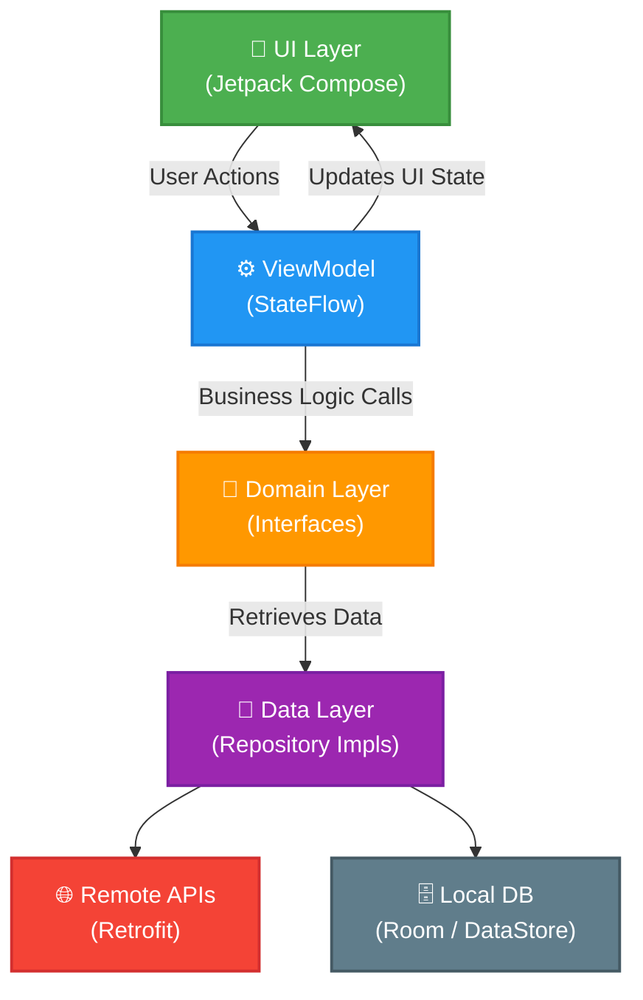

# Growzy

Growzy is a native Android application designed for exploring and tracking mutual funds. The platform allows users to discover funds categorized by type, view historical performance charts, and organize their favorite funds into custom watchlist folders.

## Features

*   **Explore:** Discover funds categorized into Index Funds, Bluechip Funds, Tax Saver (ELSS), and Large Cap Funds. Cached for offline availability.
*   **Fund Details & Charting:** View comprehensive data including AMC Name, Scheme Type, latest NAV, and a historical graphical representation of the fund's NAV.
*   **Watchlist Management:** Organize funds into user-defined custom folders. Supports multi-selection when saving a fund from the product screen.
*   **Search & View All:** Dedicated search functionality to find funds by name, alongside an infinitely scrolling "View All" list for robust category browsing.
*   **Theming:** Dynamic Light and Dark mode variations leveraging DataStore Preferences.

## Architecture

This project strictly follows the **MVVM (Model-View-ViewModel)** architectural pattern combined with elements of Clean Architecture to ensure separation of concerns, testability, and scalability.

The codebase is organized into three primary layers:
1.  **UI Layer (`ui/`):** Contains all Jetpack Compose screens, components, and ViewModels. Responsibilities are divided into stateless composables (`Content` files) and stateful containers (`Screen` files) that handle injected ViewModels and UI state observation.
2.  **Domain Layer (`domain/`):** Contains the core business logic, including repository interfaces and models designed independently of specific data sources.
3.  **Data Layer (`data/`):** Implements the repository interfaces and manages data sources (Network API and Local Database).

## Technical Stack & Libraries

*   **UI Framework:** Jetpack Compose (100% declarative UI).
*   **State Management:** Kotlin StateFlow and ViewModels.
*   **Network:** Retrofit and OkHttp for REST API communication.
*   **Local Persistence:** Room Database for saving watchlist folders, tracking saved funds, and caching explore screen queries.
*   **Key-Value Storage:** Android DataStore Preferences for saving the application theme configuration.
*   **Dependency Injection:** Manual Dependency Injection via a centralized `AppContainer` pattern.
*   **Concurrency:** Kotlin Coroutines.
*   **Code Quality:** Ktlint applied for consistent Kotlin style and formatting enforcement.

## API Integration

Data is provided by the free MFAPI interface (https://www.mfapi.in).
Because the API does not natively support category-based fetching, the system creatively seeds the local Room database by executing specific keyword queries against the search endpoint during the initial load, providing a seamless category grid experience.

## Build and Run Instructions

### Prerequisites
*   Android Studio (Iguana, Jellyfish, or newer recommended).
*   JDK 17 or higher.

### Steps
1.  Clone the repository or download the source code.
2.  Open the project directory in Android Studio.
3.  Allow Gradle to sync and download all necessary dependencies.
4.  Connect a physical Android device or start an Android Emulator.
5.  Click the "Run" button (Shift + F10) in Android Studio to build and deploy the application.

### Code Formatting
This project implements **Ktlint** for uniform code styling. 
*   To check for style violations, execute: `./gradlew ktlintCheck`
*   To automatically correct style violations, execute: `./gradlew ktlintFormat`

## State Handling & Resilience

The application defines explicit, predictable UI states (`Loading`, `Success`, `Error`, `Empty`) across all operational screens. 
*   **Offline Mode:** If network connectivity is lost, the Explore screen falls back to the local database cache seamlessly.
*   **Empty States:** Watchlist and folder detail pages feature deliberate empty-state feedback illustrations instructing the user on how to add funds.
